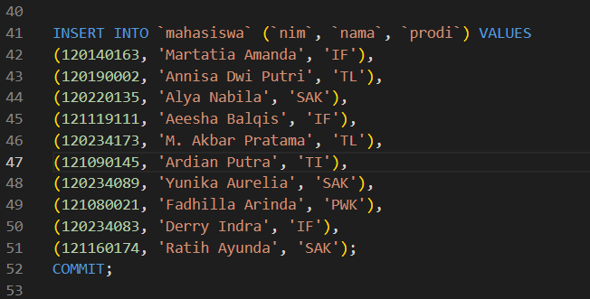
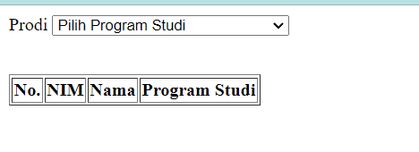
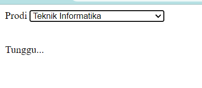
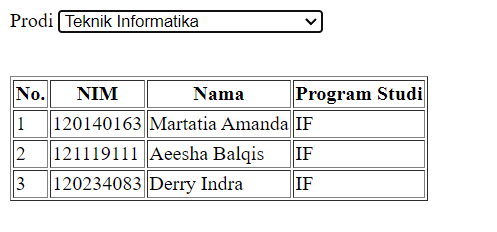

# Pertemuan 5
Tugas Praktikum Pemrogram Web RB Jadwal A Pertemuan 5

Martatia Amanda - 120140163

> Membuat aplikasi web yang dimana akan menampilkan data mahasiswa apabila user merubah pilihan program studi
yang ada menggunakan bantuan AJAX.
> Aplikasi yang terhubung ke database memiliki tabel mahasiswa yang memiliki minimal 3 data.
diantaranya NIM, Nama, dan Program Studi.
> Memiliki minimal 10 baris data mahasiswa.

Berikut dibawah ini merupakan hasil dari tugas yang dikerjakan

Data Tabel

Data yang saya buat berjumlah 10 data mahasiswa

Hasil Awal

Data yang terlihat masih kosong karena belum memilih *option* yang ada

Saat Loading

Tampilan ini saya buat agar pergantian data yang dipilih akan terlihat jelas

Hasil akhir

Data yang terlihat akan sesuai dengan yang dipilih

